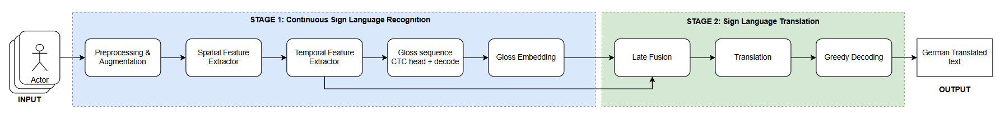
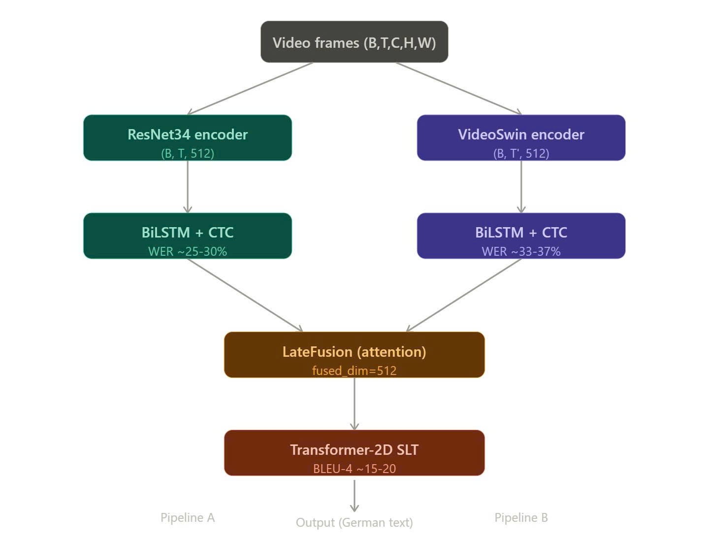

# Continuous Sign Language Recognition and Translation (CSLR & SLT) Framework

  
  
  
  
  

This repository presents an end-to-end framework for Continuous Sign Language Recognition (CSLR) and Sign Language Translation (SLT), rigorously evaluated on the **PHOENIX 2014T** dataset. 

To achieve optimal performance, our research is divided into two main methodologies:
1. **Architectural Exploration (Single-Stream):** An extensive comparative study of 9 different configurations to identify the most robust spatial and temporal extractors.
2. **The Proposed Dual-Stream Framework:** A novel hybrid architecture combining the best 2D and 3D vision models via a Cross-Attention Late Fusion mechanism.

---

## 1. Phase 1: Architectural Exploration (Single-Stream Baseline)
Before designing the final system, we conducted an extensive architectural search using a standard **Sign-to-Gloss-to-Text** pipeline. This allowed us to benchmark various backbones independently.

**Modules explored in this phase:**
- **Spatial Feature Extractors:** `ResNet18-2D`, `ResNet34-2D`, `ResNet18-3D`, `Video Swin-T`, and `Mediapipe` (Skeleton-based).
- **Temporal Modelers:** `BiLSTM`, `Transformer Encoder`, and `Conformer`.
- **Decoding Strategies:** `Beam Search` vs. `Greedy Decoding`.

---

## 2. Phase 2: The Proposed Dual-Stream Framework
Building upon the insights gained from our single-stream exploration, we designed a **Dual-Stream Architecture** that leverages both static spatial features and dynamic spatio-temporal representations.

**Key Characteristics of the Dual-Stream System:**
- **Stream 1 (2D Pathway):** Utilizes `ResNet34-2D + BiLSTM` to extract fine-grained morphological and static spatial representations per frame.
- **Stream 2 (3D Pathway):** Utilizes `Video Swin-T + BiLSTM` (clip-based processing) to capture hierarchical spatio-temporal motion trajectories.
- **Cross-Attention Late Fusion:** Instead of simple concatenation, a Cross-Attention mechanism is employed to fuse the visual hidden states from both streams with semantic Gloss Embeddings.
- **Two-Phase Training:** - *Phase A:* Freeze Stream 1 to strictly train Stream 2 and the fusion module.
  - *Phase B:* Unfreeze the entire network for global fine-tuning.

---

## 3. Dataset Overview 
The system is trained and evaluated on the **RWTH-PHOENIX-Weather 2014T** corpus. Extracted directly from broadcast weather forecasts on German public television, it provides a highly standardized parallel corpus featuring professional deaf interpreters.

- **Scale:** 8,257 continuous sign language sentences at 25 FPS.
- **Vocabulary:** 1,099 Glosses mapping to 2,887 German words.

---

## 4. Evaluation & Results
The following table summarizes the Word Error Rate (WER) performance of our independent single-stream variants tested during Phase 1. 

| No. | Spatial Extractor | Temporal Modeler | Decoding Strategy | Params | Best WER (%) | BLEU |
| :---: | :--- | :--- | :--- | :---: | :---: | :---: |
| 1 | ResNet18-2D | BiLSTM | Beam Search | 22.2M | 42.66% | - |
| 2 | ResNet18-2D | Conformer | Beam Search | 48.2M | 49.49% | - |
| 3 | ResNet18-2D | Transformer | Beam Search | 30.8M | 42.58% | - |
| 4 | Mediapipe | BiLSTM | Beam Search | 12.3M | 56.51% | - |
| 5 | Video Swin | BiLSTM | Beam Search | 39.3M | 37.35% | 10.82 |
| 6 | Video Swin | Transformer | Beam Search | 41.5M | 38.18% | - |
| 7 | ResNet34 | BiLSTM | Greedy | 33.3M | 27.32% | 13.68 |
| 8 | ResNet18-3D | BiLSTM | Beam Search | 44.2M | 60.30% | - |
| 9 | ResNet18-3D | Transformer | Beam Search | 46.5M | 60.49% | - |

---

## 6. Conclusion & Future Work

We have successfully developed a deep learning framework for Continuous Sign Language Recognition (CSLR) and Translation (SLT). Our proposed **Dual-Stream Architecture**, which synergistically combines ResNet34 and Video Swin Transformer via a Cross-Attention Late Fusion mechanism, achieved the best overall performance with a **WER of 24.84%** and a **BLEU-4 score of 15.07%**.

**Key Strengths:**
The primary advantage of our system lies in its ability to simultaneously exploit static spatial features (via the 2D CNN) and 3D spatio-temporal dynamics (via Video Swin). Furthermore, integrating these visual streams with CTC loss enables robust, end-to-end training without the need for manual frame-level alignment.

**Limitations:**
Despite the strong baseline, there remains a performance gap when compared to current State-of-the-Art (SOTA) methods. The model specifically struggles with distinguishing signs that share similar morphological shapes and translating highly complex sentence structures. Additionally, our architectural scaling and hyperparameter tuning were somewhat constrained by limited computational training resources.

**Future Directions:**
To further enhance the system's robustness and accuracy, our proposed next steps include:
* **Multi-modal Expansion:** Integrating skeletal features (e.g., from Mediapipe) directly into the Dual-Stream network to provide explicit, noise-free pose guidance.
* **LLM Integration:** Utilizing larger, more advanced pre-trained language models for the translation stage to bridge the grammar gap and improve text generation fluency.
* **Language Generalization:** Expanding the framework's capabilities to support and translate other sign languages beyond German (DGS).

---

## 7. Team Members

| Member | ID |
| :--- | :--- |
| Vu Viet Hoang | 23520548 |
| Mai Thai Binh | 23520158 |
| Truong Hoang Thanh An | 23520032 |
| Nguyen Xuan An | 23520023 |
