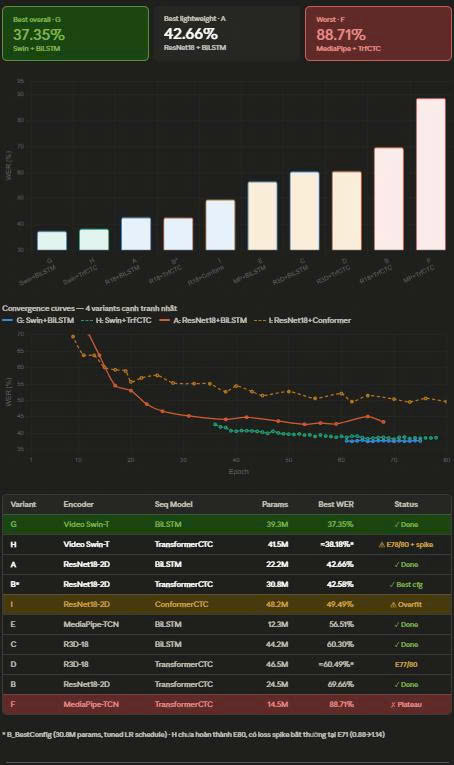

# Continuous Sign Language Recognition and Translation (CSLR & SLT) Framework

  
  
  
  
  

This repository presents an end-to-end framework for Continuous Sign Language Recognition (CSLR) and Sign Language Translation (SLT), rigorously evaluated on the **PHOENIX 2014T** dataset.

## 1. System Pipeline Workflow
The framework is designed based on a **Sign-to-Gloss-to-Text** architecture, conceptually divided into two primary stages. The multimodal data flows through the following computational modules:

* **Input:** Raw continuous sign language videos.

### STAGE 1: Continuous Sign Language Recognition (CSLR)
- **Preprocessing Module:** Handles spatial normalization, center cropping, and temporal sampling of the input video frames.
- **Spatial Feature Extractor:** Responsible for capturing fine-grained morphological and spatial representations from individual frames or skeletal keypoints. This module is designed to support comprehensive ablation studies across 5 distinct vision backbones:
  - `ResNet18-2D` (Lightweight 2D CNN)
  - `ResNet34` (Deep 2D CNN)
  - `ResNet18-3D` (Spatio-temporal 3D CNN)
  - `Video Swin` (3D Video Transformer)
  - `Mediapipe` (Skeleton-based landmark extraction)
- **Temporal Modeler:** Captures long-range contextual dependencies and spatio-temporal motion trajectories. This module alternately employs 3 temporal backbones:
  - `BiLSTM` (Bidirectional Recurrent Neural Network)
  - `Transformer` (Self-Attention mechanism)
  - `Conformer` (CNN-Transformer hybrid architecture)
- **CSLR Head (Recognition & Decoding):** Utilizes Connectionist Temporal Classification (**CTC**) Loss to optimize for weakly-aligned sequence data. It integrates 2 decoding algorithms to emit the intermediate Gloss sequence:
  - `Beam Search Decoding` (Global probability optimization)
  - `Greedy Decoding` (Local, high-throughput decoding)
- **Late Fusion Protocol:** Employs a Cross-Attention mechanism to fuse two distinct information modalities: Visual features extracted from the Temporal Modeler and semantic Gloss Embeddings.

### STAGE 2: Sign Language Translation (SLT)
- **SLT Backbone (Translation Module):** Leverages an autoregressive **Seq2Seq Transformer** (standard Encoder-Decoder architecture) to map the fused multimodal representations into natural language sequences.
- **Output:** Fluent and grammatically complete translated sentences in the target language (German).

---

## 2. Dataset Overview 
To empirically validate the robustness and practical efficacy of the proposed architecture, the system is trained and evaluated on the **RWTH-PHOENIX-Weather 2014T** corpus. Within the AI and Computer Vision research community, this dataset serves as a stringent benchmark standard specifically curated for multi-task sign language modeling (joint CSLR and SLT).

Extracted directly from broadcast weather forecasts on German public television, PHOENIX-2014T offers an exceptionally high degree of linguistic realism, featuring performances by 9 professional deaf interpreters. Surpassing the limitations of studio-simulated data, PHOENIX-2014T provides a large-scale, highly standardized parallel corpus.

Specifically, the dataset challenges the computational model with:
- A massive scale of **8,257 continuous sign language sentences**, captured at a frame rate of 25 FPS.
- A profound semantic discrepancy (domain shift): the model must learn a highly non-linear mapping from a source sign vocabulary (Gloss space) of **1,099 words** to a significantly broader target language (German) vocabulary space encompassing **2,887 words**.

This complex linguistic structure and massive statistical scale make PHOENIX-2014T the ideal testbed to measure the representational limits and generalization capabilities of deep neural architectures such as ResNet, Video Swin, and Transformers.
## 3. Evaluation (Ablation Study Results)

---

The following table summarizes the Word Error Rate (WER) performance of 9 different architectural combinations trained and evaluated on the PHOENIX-2014T dataset. 

| No. | Spatial Extractor (Encoder) | Temporal Modeler (Seq Model) | Decoding Strategy | Variant | Best WER (%) | Status / Notes |
| :---: | :--- | :--- | :--- | :---: | :---: | :--- |
| 1 | ResNet18-2D | BiLSTM | Beam Search | **A** | **42.66%** | Done (Best lightweight) |
| 2 | ResNet18-2D | Conformer | Beam Search | **I** | **49.49%** | Overfitting |
| 3 | ResNet18-2D | Transformer | Beam Search | **B*** | **42.58%** | Best cfg (Tuned LR schedule) |
| 4 | Mediapipe | BiLSTM | Beam Search | **E** | **56.51%** | Done |
| 5 | Video Swin-T | BiLSTM | Beam Search | **G** | **37.35%** | **Best overall** |
| 6 | Video Swin-T | Transformer | Beam Search | **H** | **~38.18%** | Abnormal loss spike (E71) |
| 7 | ResNet34 | BiLSTM | Greedy | *-* | *-* | ⏳ *Pending execution* |
| 8 | R3D-18 (ResNet-3D) | BiLSTM | Beam Search | **C** | **60.30%** | Done |
| 9 | R3D-18 (ResNet-3D) | Transformer | Beam Search | **D** | **~60.49%** | Incomplete (E77/80) |

> *Note: Variant **B*** represents a tuned version of Variant B (originally 69.66%) with an optimized Learning Rate schedule.*

---

## 4 Conclusion & Key Findings

Based on the ablation study results, we can draw several critical observations regarding the Continuous Sign Language Recognition (CSLR) pipeline:

1. **The Superiority of 3D Vision Transformers:** The **Video Swin-T + BiLSTM** configuration (Variant G) significantly outperformed all other models, achieving the lowest WER of **37.35%**. This indicates that leveraging Hierarchical Vision Transformers to capture spatio-temporal dynamics directly from raw video frames is highly effective for complex sign language gestures.

2. **The "Lightweight" Trade-off:** For systems with limited computational resources, the **ResNet18-2D + BiLSTM** (Variant A - 42.66%) and **ResNet18-2D + Transformer** (Variant B* - 42.58%) configurations offer an excellent balance. They deliver competitive accuracy while requiring significantly fewer parameters compared to 3D networks.

3. **Challenges with Skeleton-based and 3D-CNN Features:** The pure skeleton-based approach (**Mediapipe**, Variant E) and the traditional 3D-CNN (**R3D-18**, Variant C & D) yielded sub-optimal results (WER > 56%). This suggests that relying solely on keypoints might discard crucial visual cues (like facial expressions or hand shapes), while standard ResNet-3D architectures may struggle to converge effectively without larger datasets or specific pre-training strategies.

4. **Temporal Modeler Stability:** While Transformers and Conformers are theoretically more powerful for long-sequence modeling, our experiments showed that **BiLSTM** remains the most stable and robust temporal extractor for this specific pipeline (fewer loss spikes and overfitting issues compared to Variants I and H).

**Next Steps:** Future work will focus on completing the pending experiments (Variant 7 and 9), stabilizing the loss curve for the Video Swin + Transformer architecture, and feeding the optimal 37.35% WER features into the Stage-2 SLT Transformer.
## 5. Team Members

| Member | ID |
| :--- | :--- |
| Vu Viet Hoang | 23520548 |
| Mai Thai Binh | 23520158 |
| Truong Hoang Thanh An | 23520032 |
| Nguyen Xuan An | 23520023 |
